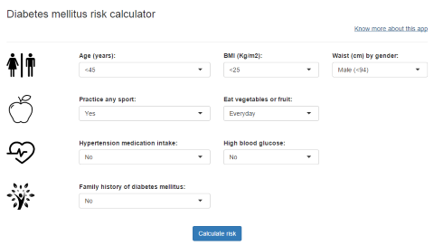

## Scope

As of 2014, an estimated 387 million people have diabetes worldwide, with type 2 diabetes making up about 90% of the cases. This represents 8.3% of the adult population, with equal rates in both women and men.
Information from several clinical trials strongly supports the idea that type 2 diabetes is preventable. 

**So, start to know your risk score**

  
Published on: https://paulorochasa.shinyapps.io/DiabetesRiskCalc/

--- .class #id 

## Health required data

To measure the risk the following health data was consider:
- Age
- Body Mass Index
- Waist by gender
- Sport practice
- Eating habits
- Hypertension medication intake
- Blood glucose
- Family history

Each item contains several options, and each has a related risk score.  
The sum of the scores obtained through the options selected gives rise to the final score

--- .class #id 

## Application usage

  

--- .class #id 

## Interpret risk score

| id|score            |detail                                                        |
|--:|:----------------|:-------------------------------------------------------------|
|  1|Low (<7)         |It is estimated that 1 in 100 people will develop the disease |
|  2|Slight (7-11)    |It is estimated that 1 in 25 people will develop the disease  |
|  3|Moderate (12-14) |It is estimated that 1 in 6 people will develop the disease   |
|  4|High (15-20)     |It is estimated that 1 in 3 people will develop the disease   |
|  5|Severe (>20)     |It is estimated that 1 in 2 people will develop the disease   |

